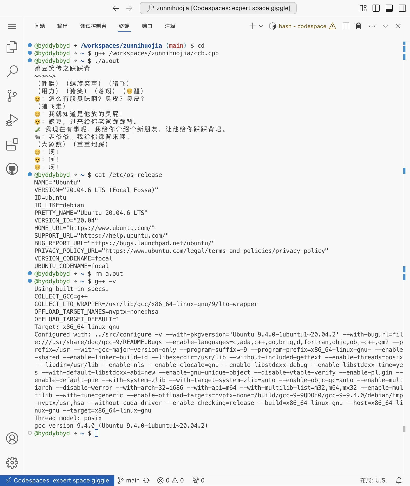

# 踩踩背

> 老爷爷，我给你踩背来喽！

> [!IMPORTANT]
> 悲报：公元 2025 年 3 月 10 日，《电棍笑传之踩踩背》被拿下，历时 606 天 1 时 28 分，这是踩背史上最沉重的时刻。

## 重温经典

## 踩踩背大全
- [踩踩背](./ccb)
- [CCB.CPP](./ccb.cpp)  
  
[*DeepSeek版*](./ccb-deepseek.cpp)
- [踩踩背档案馆](./ccb-archive.md)
- [踩踩背短语](./ccb-words.md)
- [踩踩背古诗词](./ccb-poems.md)
- [《踩踩背序》by DeepSeek](./ccbx.md)